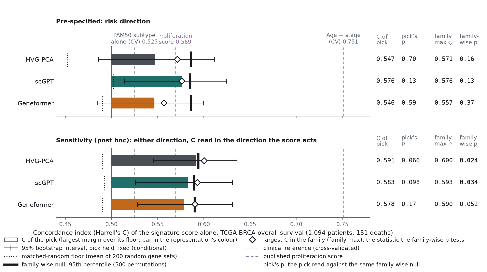

# Single-cell foundation-model cell states and breast-cancer survival

Do the cell states that single-cell foundation models find in a tumour atlas predict patient survival
better than the states a linear baseline finds? A test on 50,002 breast-cancer cells, 1,094 patients of
The Cancer Genome Atlas (TCGA) and an independent replication in 1,979 patients (1,980 with expression) of
the Molecular Taxonomy of Breast Cancer International Consortium (METABRIC).

**Result.** Cell states from scGPT and Geneformer, turned into marker-gene signatures and scored in
TCGA-BRCA (The Cancer Genome Atlas breast cohort), predict overall survival (OS) no better than states
from highly-variable-gene principal component analysis (HVG-PCA): no representation's best signature
clears its family-wise permutation null (p = 0.16 HVG-PCA, 0.13 scGPT, 0.37 Geneformer), and the
selection-aware margin of each foundation model over the baseline is negative (−0.021 scGPT, −0.039
Geneformer, in concordance index above the random-gene floor). Added to age and stage, no
foundation-model state improves the concordance index (C-index) under nested cross-validation, while
the published 11-gene proliferation score of the PAM50 (Prediction Analysis of Microarray, 50 genes)
subtype classifier does (+0.008). In METABRIC, scored with signatures frozen before the outcomes were
read, all eight foundation-model-minus-baseline margins are negative (intervals below zero for one of the
four pre-specified comparisons and all four post hoc ones) and the proliferation score replicates most
strongly (OS C = 0.583 against a random-gene floor 95th percentile of 0.545).



Project page with the full write-up: <https://natalija-stepurko.github.io/single-cell-fm-probing/>.
Design, predictions and corrections: [`docs/DESIGN.md`](docs/DESIGN.md). Related work:
[`research/literature.md`](research/literature.md).

## What was done

1. **Atlas.** 50,002 cells from 152 donors in 8 CELLxGENE datasets (nine breast-carcinoma disease
   labels, primary data, droplet-based 3′ and 5′ chemistries), drawn in proportion to the 48 annotated
   cell types. 577 of them (1.2%) duplicate another atlas cell exactly, between Chen et al.'s Global Atlas
   and its compartment datasets; they were not removed (49,425 unique cells,
   `results/report/atlas_duplicates.json`).
2. **Three representations of every cell.** scGPT (whole-human checkpoint, 512-dimensional cell
   embedding), Geneformer (V1, 6 layers, mean-pooled last layer) and the baseline: principal components
   of the highly variable genes (HVG-PCA).
3. **Cell states → signatures.** Leiden clustering of each representation at three resolutions; each
   state's top 25, 50 or 100 marker genes (Wilcoxon test, restricted to the 16,297 genes also measured
   in bulk) form a signature: 369 for HVG-PCA, 201 for scGPT, 213 for Geneformer.
4. **Score in bulk.** Each signature is the mean z-score of its genes in each of 1,094 TCGA-BRCA primary
   tumours (151 deaths). The concordance index of that score alone (Harrell's C) measures how well it
   orders patients by OS; a Cox proportional-hazards model with age and stage gives its hazard ratio.
5. **Read against a ladder.** A family-wise permutation null for the best of each representation's
   signatures (500 outcome permutations), a floor of 200 random gene sets matched on size and mean
   expression, the HVG-PCA baseline, and references: age + stage, the PAM50 intrinsic subtype alone,
   PAM50 with age + stage, and the published PAM50 11-gene proliferation score (chosen after the first
   run to fill the design's published-signature rung; pre-specified for METABRIC).
6. **Pre-specified predictions** P1–P4 (design commit
   [`8d2c2d0`](https://github.com/Natalija-Stepurko/single-cell-fm-probing/commit/8d2c2d0), 2026-09-28,
   before any data were downloaded), a post-hoc sensitivity analysis that reads protective signatures in
   their own direction, added value over age and stage under nested cross-validation, multivariable
   models of all states, and a frozen-signature replication in METABRIC.

How each prediction came out, including where the first run's code departed from the design and what
is reported now, is in [`docs/DESIGN.md` §12](docs/DESIGN.md#12-deviations-from-the-design-and-corrections).

## Pipeline

Each stage is a named tool with a dry-run plan; `scfm run` writes a JSON run log
(`results/run_log.json`) and every stage writes `params.json` beside its outputs (arguments, git commit
and dirty flag, library versions, pinned model revisions, timestamp).

| Stage (`scfm run …`) | Module | Does |
|---|---|---|
| `data` | `stages/data.py` | atlas from CELLxGENE Census (quality control, HVGs, stratified subsample, or `--cell-list` to rebuild the tracked one); TCGA-BRCA expression, clinical and survival tables from UCSC Xena, checked by sha256; asserts that no atlas donor carries a TCGA barcode |
| `embed` | `stages/embed.py` | one embedding per cell for `hvg_pca`, `scgpt` (subprocess in the scGPT environment, `scgpt_worker.py`) and `geneformer`; bfloat16, length-sorted batches, sharded and resumable |
| `states` | `stages/states.py` | Leiden clusters per representation and resolution → marker-gene signatures; state composition (donors, datasets, cell types); uniform manifold approximation and projection (UMAP) coordinates |
| `translate` | `stages/translate.py` | signature scores in bulk; C-index; Cox hazard ratio with age and stage; family-wise permutation null; matched-random floor; reference models |
| `ladder` | `stages/ladder.py` | the ladder; patient bootstraps; P1–P4 as coded and corrected; per-setting ladder; added value over age + stage (fixed and nested cross-validation) |
| `stratify` | `stages/stratify.py` | cross-validated multivariable models: all of a representation's states with age + stage (ridge Cox and gradient-boosted Cox) |
| `report` | `stages/report.py` | figures, candidate shortlist, validation template |
| `replicate` | `stages/replicate.py` | METABRIC replication: `--freeze` writes the frozen signatures, `--real-outcomes` scores them (refuses unless the frozen file is committed and unmodified), `--shuffle-outcomes` tests the stage on permuted outcomes; not part of `scfm run all` |

```bash
uv run scfm list                      # stages, interpreter, root and log path
uv run scfm run all --dry-run         # every stage's plan; dry runs are never logged
uv run scfm run translate -- --endpoint PFI   # arguments after -- go to the stage
```

## Reproduce

Two environments, both locked with `uv`. scGPT pins `torchtext` and torch 2.3.1, so it runs in its own
Python 3.11 environment (`envs/scgpt`). Set `UV_PROJECT_ENVIRONMENT` and `HF_HOME` first if the
environment and the model weights should live outside the checkout. `SCFM_ROOT` reads `data/` and writes
`results/` under another directory; `SCGPT_PYTHON` points at a scGPT environment elsewhere.

Times below are stage times from `results/run_log.json` and `results/embeddings/params.json` on a
shared CPU-only machine (embedding on 4 cores).

**Tier A: from the tracked results, core environment only (about 40 min).** Rebuilds everything
downstream of the tracked signatures (`results/states/signatures.json`): the bulk cohort from the pinned
Xena downloads, then translate, ladder, stratify and report for OS, and translate and ladder for the
progression-free interval (PFI). No model, atlas or GPU is needed.

```bash
uv sync --locked --group dev
make reproduce        # deletes and regenerates results/{translate,ladder,stratify,report,translate_pfi,ladder_pfi}
make verify           # compares every tracked file under results/ with results/MANIFEST.sha256
```

The translate stages take 15–20 min each (OS and PFI), the ladder stages 3–4 min each, stratify
about 1 min. The UMAP figure needs the per-cell tables from `states`
(`results/states/cells_<model>.parquet`, not tracked) and is skipped without them.

**Tier B: from embeddings (not distributed).** The per-cell embeddings (125 MB for the three
representations) are not in the repository. With them in `results/embeddings/`, rebuild the exact atlas
from the tracked cell list and run from `states` onward:

```bash
uv sync --locked --all-extras --group dev
uv run scfm run data -- --cell-list results/atlas_cells.csv   # same 50,002 cells, from Census 2025-11-08
uv run scfm run states                                          # about 8-12 min
make reproduce && make verify
```

**Tier C: from scratch, both environments (about 2 h 45 min of stage time on CPU, plus environment
setup and model download).**

```bash
make setup            # main environment, all extras and dev tools
make scgpt-env        # envs/scgpt/.venv from envs/scgpt/uv.lock (CPU torch 2.3.1, scgpt 0.2.4)
make all              # data -> embed -> states -> translate -> ladder -> stratify -> report (OS)
uv run scfm run translate -- --endpoint PFI && uv run scfm run ladder -- --endpoint PFI
uv run scfm run replicate -- --real-outcomes                    # METABRIC, about 4 min after a 690 MB download
make verify
```

| Stage | Measured |
|---|---|
| `data` (Census query and Xena downloads) | 1 min 15 s |
| `embed`, all three representations | 1 h 44 min (scGPT 83 min, about 10 cells/s; Geneformer 21 min, about 40 cells/s) |
| `states` | 8–12 min |
| `translate` (OS) | 15–19 min |
| `ladder` | 3–4 min |
| `stratify` | 1 min |
| `report` | under 10 s |
| `replicate --real-outcomes` | 4 min 21 s |

The atlas sampling is seeded and runs against the pinned Census release, so a fresh `data` stage should
write the same `results/atlas_cells.csv`; `make verify` checks it. Embedding runs in bfloat16 on CPUs
with Advanced Matrix Extensions (AMX); `scfm run embed -- --precision fp32 --limit 300` recomputes a
subset in fp32 (no such comparison is tracked in `results/`). The tracked embeddings were computed before
the model revisions were pinned in `config.py`; the pinned revisions are the only snapshots of each model
in the download cache that run used.

**Smoke run.** `make smoke` runs every stage except `replicate`, including both foundation models, on 2,000 cells with
short control loops and writes to `smoke/` (about 7 min; network needed).

**Tests and continuous integration (CI).** `make test lint` runs pytest and ruff; the tests are offline
except one that downloads the Geneformer V1 dictionaries and checks the tokeniser against the official one
on 30 cells. Continuous integration runs ruff and pytest on pushes to `main` and on pull requests, with
the core dependencies only.

## Data

| | Source | Version and check | Used |
|---|---|---|---|
| Single-cell atlas | CELLxGENE Census, `Homo sapiens`, nine breast-carcinoma labels, `is_primary_data`, droplet-based 3′ and 5′ assays | Census `2025-11-08`; cell list `results/atlas_cells.csv` | raw counts, cell type, donor, dataset |
| Bulk RNA-seq | TCGA-BRCA, UCSC Xena `HiSeqV2` (log2 RSEM + 1) | sha256 `263bf672…22133746` | 1,094 primary tumours |
| Clinical | Xena `BRCA_clinicalMatrix` | sha256 `39eb3be0…99580d7f` | age, stage, PAM50 call |
| Survival | TCGA Pan-Cancer Clinical Data Resource (TCGA-CDR) on Xena | sha256 `a5e70415…c5df9617` | OS, PFI |
| Replication | METABRIC, cBioPortal datahub `brca_metabric` | datahub commit `dca75cb3`; sha256 of the three files in `config.py` | HT-12 expression microarray, age, PAM50, OS, disease-specific survival (DSS) |
| scGPT | `wanglab/scGPT-human` (whole-human) | revision `a24c2377…753be6` | 512-dimensional cell embedding |
| Geneformer | `ctheodoris/Geneformer`, `Geneformer-V1-10M`, V1 dictionaries | revision `1f7fbae4…3829f5` | 256-dimensional cell embedding |

Full checksums and revisions are in `src/scfm/config.py`. Every file download (Xena, METABRIC) is checked
against its sha256; the atlas is pinned to the Census release and the models to repository revisions.

The atlas datasets, from `results/atlas_cells.csv` and the CELLxGENE collection records:

| Dataset | Source publication | Cells | Donors |
|---|---|---|---|
| `de5416ef` Global Atlas | Chen et al. 2026, integrated breast-cancer atlas | 20,384 | 67 |
| `7b20c613` | Gondal et al. 2025, integrated immune-checkpoint-blockade datasets (BIOKEY donors, Bassez et al. 2021) | 11,383 | 42 |
| `ed880090` Epithelial compartment | Chen et al. 2026 | 6,460 | 33 |
| `9fddb063` | Wu et al. 2021 | 5,291 | 26 |
| `5a9cfb44` Immune compartment | Chen et al. 2026 | 3,830 | 31 |
| `b617ee1b` | Guimarães et al. 2024 multi-tissue atlas (breast donors from Qian et al. 2020) | 1,508 | 14 |
| `75011e96` Stromal compartment | Chen et al. 2026 | 878 | 31 |
| `6c87755e` | Klughammer et al. 2024 (metastatic biopsies) | 268 | 3 |

Chen et al.'s collection supplies 31,552 of the 50,002 cells (63%). The cohorts are independent
collections; the `data` stage also asserts that no atlas donor carries a TCGA barcode.

## Statistical conventions

- The patient is the unit of independence. Intervals on C-indices and margins are patient bootstraps;
  hazard-ratio intervals are Wald 95% intervals (nominal for selected picks); the ranges on
  cross-validated changes span fold repeats on the same patients and are not confidence intervals.
- Every C-index on the ladder is Harrell's C of the signature score alone. Age and stage enter separately:
  as covariates of each signature's Cox hazard ratio, and as the base model for added value.
- Every score is read above its matched-random floor and against a family-wise permutation null, the
  distribution of the best C over a representation's signatures under permuted outcomes.
- Permutation p-values carry their Monte-Carlo standard error; a p within two standard errors of 0.05 is
  flagged as borderline.
- Analyses added after the design each draw from their own random stream, so the pre-specified numbers
  (design commit `8d2c2d0`; there is no external registry) are unchanged by them.

Details, the predictions and every deviation: [`docs/DESIGN.md`](docs/DESIGN.md).

## Design history

| Date (UTC) | Commit | What |
|---|---|---|
| 2026-09-28 | [`8d2c2d0`](https://github.com/Natalija-Stepurko/single-cell-fm-probing/commit/8d2c2d0) | design §1–§10 and predictions P1–P4, before any data were downloaded (first download 2026-09-29) |
| 2026-09-30 | [`b86c51d`](https://github.com/Natalija-Stepurko/single-cell-fm-probing/commit/b86c51d) | post-hoc direction-of-effect sensitivity analysis (DESIGN §11) |
| 2026-10-01 | [`00a00c7`](https://github.com/Natalija-Stepurko/single-cell-fm-probing/commit/00a00c7), [`aaf31d3`](https://github.com/Natalija-Stepurko/single-cell-fm-probing/commit/aaf31d3) | corrected statistics beside the as-coded ones (DESIGN §12) |
| 2026-10-01 16:37 | [`2ebb73e`](https://github.com/Natalija-Stepurko/single-cell-fm-probing/commit/2ebb73e) | METABRIC replication specified and signatures frozen (DESIGN §13) |
| 2026-10-01 16:42 | [`35c9233`](https://github.com/Natalija-Stepurko/single-cell-fm-probing/commit/35c9233) | METABRIC results on real outcomes |

## Repository layout

```
src/scfm/             the package: cli.py, config.py, provenance.py, survival.py, batching.py,
                      geneformer.py, scgpt_worker.py, verify.py, stages/ (one module per stage)
envs/scgpt/           the locked scGPT environment (Python 3.11)
tests/                pytest; fixtures for the Geneformer tokeniser
docs/DESIGN.md        the design, the sensitivity analysis, deviations and corrections, the replication spec
docs/index.html       the project page (GitHub Pages), built by docs/site/build.py from results/
research/             related work
results/              tracked: cell list, signatures, state composition, scores, nulls, ladders,
                      stratification, METABRIC replication, figures, params and run log;
                      MANIFEST.sha256 for `make verify`. Embeddings and per-cell tables stay local.
data/  smoke/         git-ignored
```

## Licence and data terms

Code: MIT (`LICENSE`). Data are downloaded at run time and not redistributed: CELLxGENE Census data are
CC BY 4.0 (the tracked `results/atlas_cells.csv` lists Census cell, donor and dataset identifiers);
TCGA-BRCA expression and clinical data are open-access tier; METABRIC from the cBioPortal datahub is
under the Open Database License, and only aggregate statistics from it are written to `results/`.

## How to cite

```bibtex
@misc{stepurko2026scfm,
  author = {Stepurko, Natalija},
  title  = {Single-cell foundation-model cell states and breast-cancer survival},
  year   = {2026},
  url    = {https://github.com/Natalija-Stepurko/single-cell-fm-probing}
}
```
